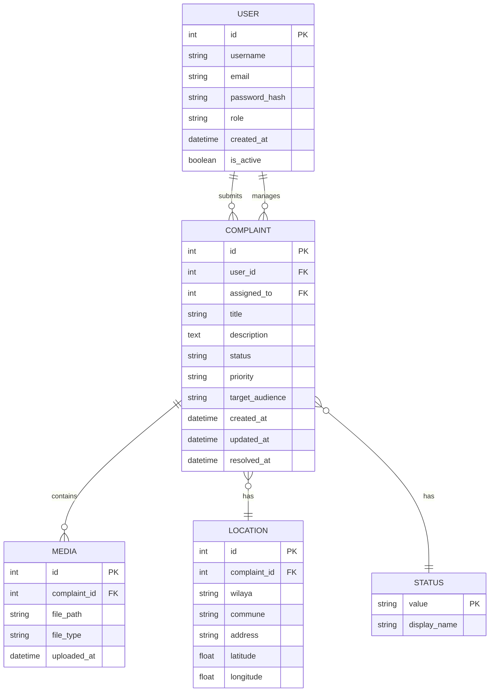

# Public Service Complaint System

A centralized platform to report, track and manage public service complaints in Algeria. Citizens (mwatin) can submit complaints with location and media, while officials use an admin dashboard to manage and resolve issues.

- Front-end demo: https://complaint-system-pi.vercel.app
- Back-end: Can be built with Docker (example: `docker build -t complaint .`)

## Table of Contents
- [Project Overview](#project-overview)
- [Tech Stack](#tech-stack)
- [Features](#features)
- [Project Structure](#project-structure)
- [Data Model (ER Diagram)](#data-model-er-diagram)
- [Getting Started](#getting-started)
  - [Front-end (Next.js)](#front-end-nextjs)
  - [Back-end (Django)](#back-end-django)
  - [Using Docker](#using-docker)
- [Apps](#apps)
- [Contributing](#contributing)
- [License & Contact](#license--contact)

## Project Overview
This system centralizes problem reporting: citizens can submit complaints including location and media attachments; administrators and responsible officials can monitor, assign, and resolve complaints. The idea is currently scaling up in Algeria.

## Tech Stack
- Front-end: Next.js (App Router) / React
- Back-end: Django / Python
- Database: SQLite (development)
- Containerization: Docker

## Features
- Citizen-facing complaint submission with location and media
- User authentication (register / login)
- User dashboard to view submitted complaints
- Admin dashboard for officials to manage and assign complaints
- Analytics and reporting
- Role-based permissions for access control
- API endpoints (Django REST framework-style serializers and views)

## Project Structure

Front-end (Next.js / React - App Router)
- /app - Main application directory using App Router
  - /admin - Admin dashboard interface
  - /analytics - Analytics and reporting views
  - /dashboard - User dashboard for viewing complaints
  - /login - Authentication login page
  - /register - User registration page
  - /unauthorized - Access denied page
  - layout.tsx - Root layout component
  - page.tsx - Home page
  - globals.css - Global styles

Back-end (Django / Python)
- manage.py - Django management script
- requirements.txt - Python dependencies
- Dockerfile - Container configuration
- db.sqlite3 - SQLite database (development)

Apps
- /admin - Django admin configuration (settings, URLs, WSGI/ASGI)
- /users - User authentication and management (models, serializers, views)
- /complaints - Core complaint management system (models, serializers, views)
- /myapp - Additional application module
- /bruno - API testing collection (Bruno API client)

## Data Model (ER Diagram)


## Getting Started

Prerequisites:
- Node.js + npm/yarn (for front-end)
- Python 3.8+ and pip (for back-end)
- Docker (optional but recommended)
- (Optional) PostgreSQL or another production-ready DB for deployment

### Front-end (Next.js)
1. cd into the front-end directory (e.g., the repository root if Next app is in /app)
2. Install dependencies:
   - npm install
   - or yarn install
3. Start dev server:
   - npm run dev
   - or yarn dev
4. Build for production:
   - npm run build
   - npm start

### Back-end (Django)
1. Create and activate a virtual environment
2. Install dependencies:
   - pip install -r requirements.txt
3. Apply migrations:
   - python manage.py migrate
4. Create a superuser (for admin dashboard):
   - python manage.py createsuperuser
5. Run the dev server:
   - python manage.py runserver

### Using Docker
Build the container (example):
- docker build -t complaint .

Run with Docker (example):
- docker run -p 8000:8000 complaint

(You may want to extend the Dockerfile and add docker-compose for multi-service setups, e.g., separate DB and front-end.)

## Apps (short)
- /users — authentication, user profile, permissions
- /complaints — complaint models, API serializers, views, permissions, signal handlers
- /admin — admin site and configuration
- /myapp — additional modules
- /bruno — API testing collection

## Contributing
Contributions are welcome. Suggested workflow:
1. Fork the repo
2. Create a branch: git checkout -b feature/your-feature
3. Make changes, add tests
4. Open a pull request describing your changes

Please follow conventional commit messages and include a clear description and testing steps in your PR.

##  Contact :  
Contact / author: 4ym3nn
PI" section documenting endpoints,
- or produce a docker-compose.yml for local development. Tell me which you'd like next.
``` ````
