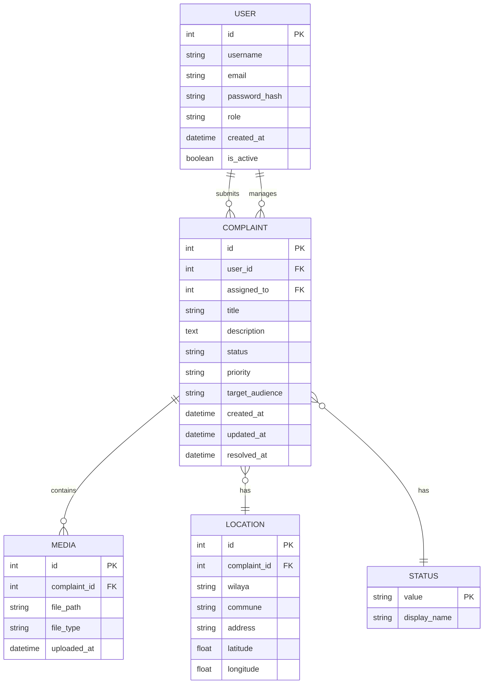

The public service complaint system is an idea I developed to centralize problem reporting in Algeria. Citizens (mwatin - those who belong to Algeria) can submit complaints by providing the location, detailed information, photos, and identifying the target audience.
We also provide an admin dashboard for officials to control and track these problems. The idea is currently scaling up.
so 
Front-end demo: https://complaint-system-pi.vercel.app
Back-end: Can be built with Docker using docker build -t complaint .

Project Structure:
Front-end (Next.js/React):

/app - Main application directory using App Router

/admin - Admin dashboard interface
/analytics - Analytics and reporting views
/dashboard - User dashboard for viewing complaints
/login - Authentication login page
/register - User registration page
/unauthorized - Access denied page
layout.tsx - Root layout component
page.tsx - Home page
globals.css - Global styles

Back-end (Django/Python):

manage.py - Django management script
requirements.txt - Python dependencies
Dockerfile - Container configuration
db.sqlite3 - SQLite database

Apps:

/admin - Django admin configuration (settings, URLs, WSGI/ASGI)
/users - User authentication and management

Models, serializers, views for user operations
Custom migrations

/complaints - Core complaint management system

Models for complaint data
Permissions and access control
Serializers for API responses
Signal handlers for automated actions
API views and URL routing

/myapp - Additional application module
/bruno - API testing collection (Bruno API client)"
    ``
